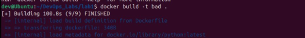
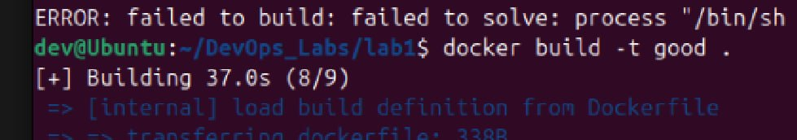
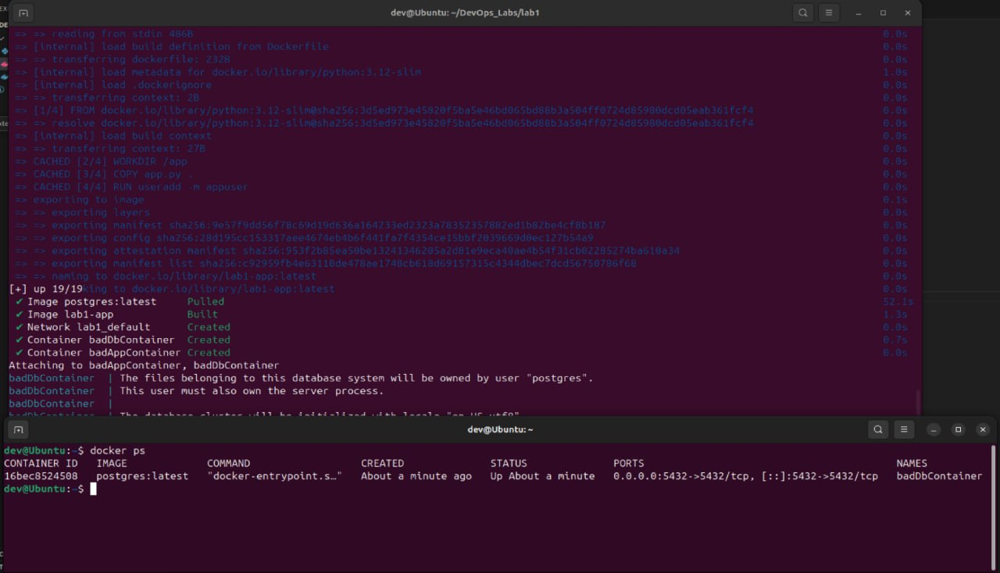
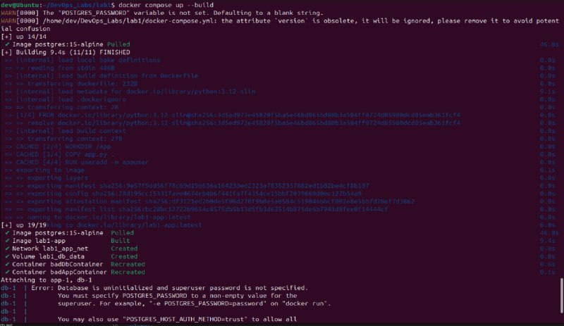
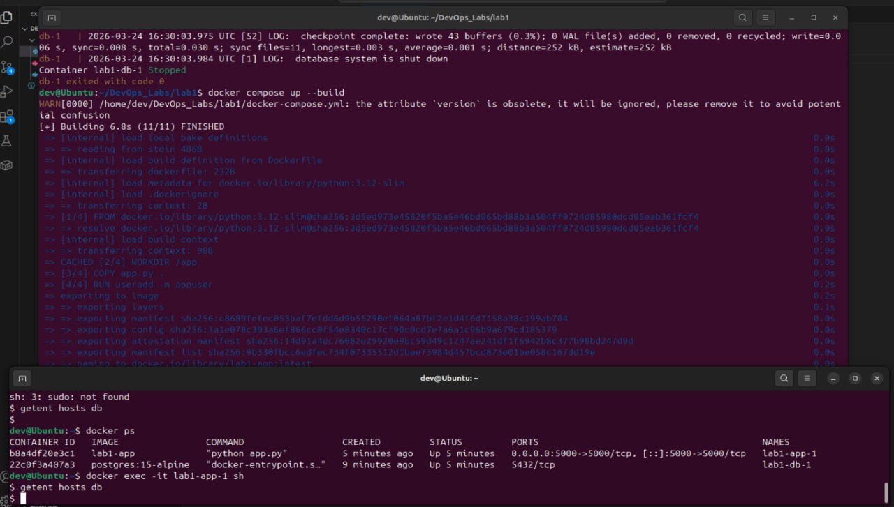

# Задание на первую лабораторную работу

**1 часть**

1. Написать “плохой” Dockerfile, в котором есть не менее трех “bad practices” по написанию докерфайлов
2. Написать “хороший” Dockerfile, в котором эти плохие практики исправлены
3. В Readme описать каждую из плохих практик в плохом докерфайле, почему она плохая и как в хорошем она была исправлена, как исправление повлияло на результат
4. В Readme описать 2 плохих практики по работе с контейнерами. ! Не по написанию докерфайлов, а о том, как даже используя хороший докерфайл можно накосячить именно в работе с контейнерами.

**2 часть**
1. Написать “плохой” Docker compose файл, в котором есть не менее трех “bad practices” по их написанию
2. Написать “хороший” Docker compose файл, в котором эти плохие практики исправлены
3. В Readme описать каждую из плохих практик в плохом файле, почему она плохая и как в хорошем она была исправлена, как исправление повлияло на результат
4. После предыдущих пунктов в хорошем файле настроить сервисы так, чтобы контейнеры в рамках этого compose-проекта так же поднимались вместе, но не "видели" друг друга по сети. В отчете описать, как этого добились и кратко объяснить принцип такой изоляции

# Отчет по выполненной работе

**Часть 1**
Все реализации Dockerfile (с "bad practices" и без) находятся в файле Dockerfile и разделены комментариями. В качестве "bad practices" выступают следующие пункты:
1) Скачивание latest версии - различные пользователи могут скачать разные версии из-за чего могут крашнуться зависимости, что приведет к неработоспособности контейнера.
2) Копирование всей директории - может скопироваться лишний мусор, кэн и др., что займет лишнее время выполнения и также лишнюю память.
3) Запуск от root - супер небезопасно, т.к. мало ли что можно сделать от лица root.

В "хорошей" реализации Dockerfile данные косяки устранены. Пример выполнения команды docker build для bad и good представлены на рисунках 1 и 2 соответственно.

  

  <b>Рисунок 1</b>

  

  <b>Рисунок 2</b>

Исправление bad practices ускорило сборку в ~2,7 раза.

Что касается bad practices при работе с контейнерами, первое это избыточное предоставление root прав при запуске контейнера. Так, при наличии уязвимостей внутри контейнера, злоумышленники могут получить доступ к системе хоста.
Другой частой ошибкой является проброс портов наружу без необходимости. Например, пробрасывать порты базы данных на хост. В таком случае сервис становится доступен извне, что особенно опасно для таких компонентов ка БД или API.

**Часть 2**
Аналогично первой части, bad и good реализации содержатся в одном файле docker-compose.yml. В части bad показаны следующие нежелательные элементы:
1) Тег latest - проблема, аналогична предыдущему пунтку.
2) container_name - при попытке создать несколько сервисов при масштабировании будет выдавать ошибку, поскольку сервис с данным именем будет уже существовать.
3) Открытие портов без необходимости - по сути та же проблема, что была описана ранее, дыра в безопасности (а мы нет...)
4) Хардкор пароля - также влияет на безопасность.
5) bind mount всего проекта (.:/app) - ломает воспроизводимость и может перетирать файлы внутри контейнера.

В good данные косяки были исправлены. Запуск команд docker compose для bad и good представлены на рисунках 3 и 4 соответственно.

  

  <b>Рисунок 3</b>

  

  <b>Рисунок 4</b>

Далее контейнеры были изолированы друг от друга (код также представлен в docker-compose.yml) с помощью различных Docker-сетей. Проверка проводилась с помощью getent - по результату выполнения команды ничего не выводилось, что свидетельствует о изоляции контейнеров друг от друга (рисунок 5).

  

  <b>Рисунок 5</b>

